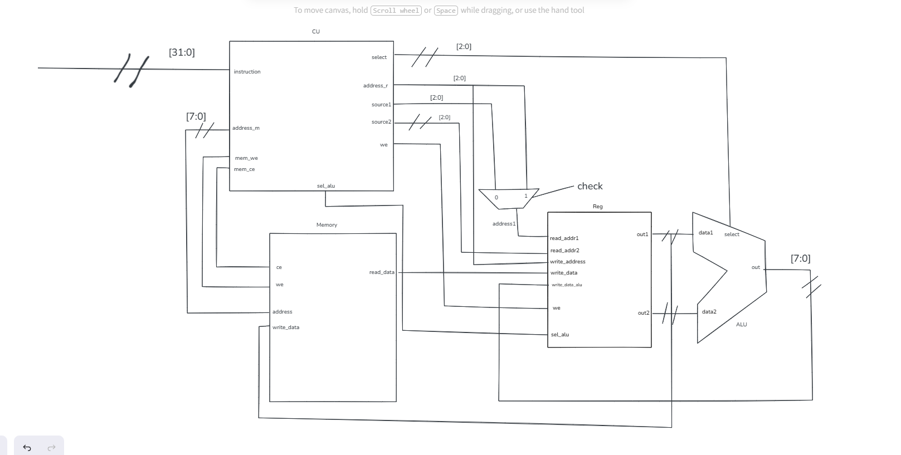

# 8-bit Processor

Procesor pe 8 biti modelat in Verilog

---

## Instructiuni

- Aritmetice : ADD, SUB
- Logice : AND, OR, SHIFTL, SHIFTR
- Memorie: LOAD, STORE

---

## Arhitectura (opțional)

---
